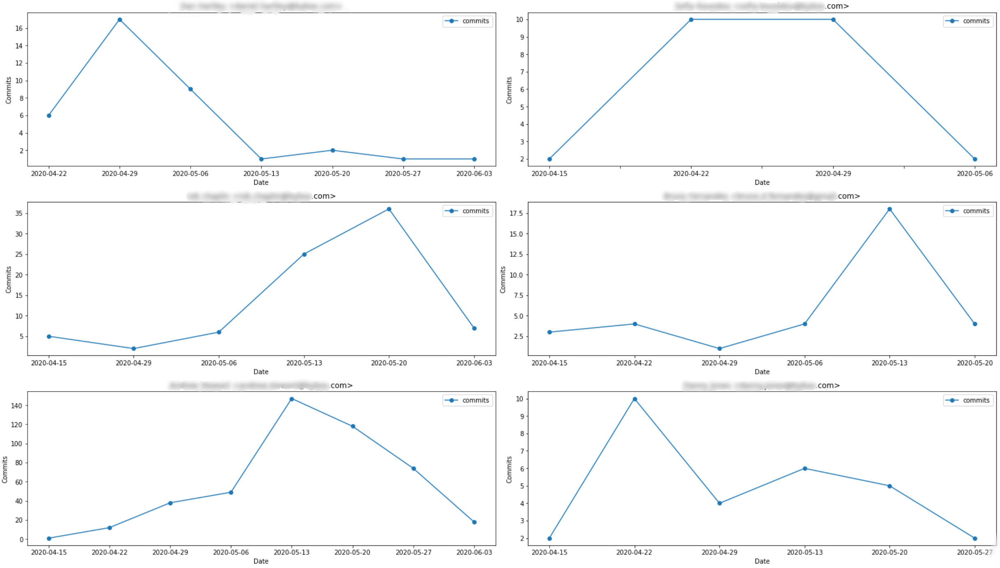

# git-author-chart
Consolidate Git Commits by Authors

If you are using Bitbucket and looking for the feature like Contributor Insight in Github, this code might be of used for you. It consolidates the contributor and generate the summary of commits/files/changes for a range of weeks and the set of repos. 
The code relied on [git-quick-stats](https://github.com/amiller/git-quick-stats) to generate the git log output data before it generates the summary and graph.

## Sample Graph

